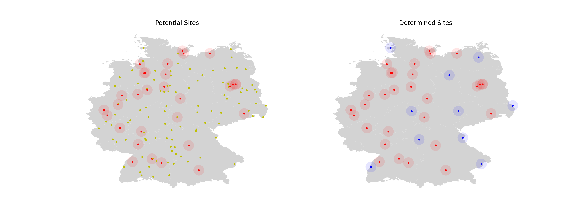

[](
  https://ide.dwavesys.io/#https://github.com/dwave-examples/antenna-selection)
[](
  https://circleci.com/gh/dwave-examples/antenna-selection)

# Antennas Selection

This code was taken from the webinar, *Quantum Programming with the Ocean Tools
Suite* [[2]](#2).

The graph below represents antenna coverage. Each of the seven nodes below
represents an antenna with some amount of coverage. Note that the coverage
provided by each antenna is identical. The edges between each node represent
antennas with overlapping coverage.


Problem: Given the above set of antennas, which antennas should you choose such
that you maximize antenna coverage without any overlaps?

Solution: One possible solution is indicated by the red nodes below.


This problem is an example of an optimization problem known as the maximum
independent set problem.  Our objective is to maximize the number of nodes in a
set, with the constraint that no edges be contained in the set.  To solve on a
D-Wave system, we can reformulate this problem as a quadratic unconstrained
binary optimization problem (QUBO).  There are a wide variety of applications
for this problem, such as scheduling and error correcting codes (as shown in
[[1]](#1)).

## Usage

To run the demo:

```bash
python antennas.py
```

After running, the largest independent set found in the graph will be printed
to the command line and two images (.png files) will be created.  An image of
the original graph can be found in the file `antenna_plot_original.png`, and
an image of the graph with the nodes in the independent set highlighted in a
different color can be found in the file `antenna_plot_solution.png`.

To run the program on a different problem, modify graph G to represent a
different antenna network.

## Code Overview

The program `antennas.py` creates a graph using the Python package `networkx`,
and then uses the Ocean software tools to run the `maximum_independent_set`
function from within the `dwave_networkx` package.

## Real-World Scenario

Germany is well-known for their iconic television towers. Given the locations
of existing television towers, where should new ones be built to minimize
interference? Using the LeapHybridCQMSampler we can solve this problem,
formulated as a constrained quadratic model (CQM) in the following way. Rather
than formulating this problem as an independent set problem where no
interference is tolerated, we will optimize to find the minimum amount of
interference since it's unlikely that in the real-world we will be able to
eliminate it entirely.

### CQM Formulation

A map of Germany with the locations of 30 towers is provided, and 100 new
potential tower locations are identified randomly within the country borders.

Our objective is to select a subset of these potential new tower locations so
that the pairwise distances between all towers (existing and new) is as large
as possible. In the code, we do this by first calculating all pairwise
distances. Note that if we simply sum these raw distances we might end up with
a variety of distance distrubtions. For example, we might have pairs of towers
with distance 1 and 9, and other pairs with distance 5 and 5, each of which has
a sum of 10. In our scenario, we will prefer the pairs with distance 1 and 9.

To rectify this, we square the distances before summing them. Squaring the
distances provides a more even distribution. In our example, this provides us
with distance sums 1+81=82 and 25+25=50, prefering the pairs with distances 1
and 9 (since we are maximizing the sum).

Additionally, since interference only affects towers within a certain proximity
of each other, we set a cutoff radius. Every pair of towers with distance
greater than the cutoff radius receives a minimum-value bias so that they are
not penalized for both being selected. Each pair of towers with distance less
than the cutoff radius receives a bias of the negative of the distance squared.

Lastly, we add a constraint to choose exactly 10 new towers and fix the
existing tower variables to have value 1.0. This ensures that the existing
towers are identified as locations where towers must exist.

### Running the Demo

To run the demo:

```bash
python demo.py
```

Once the program has run, an image will be saved as `map.png` that visualizes
the initial scenario (left) and solution (right), as shown below.



## Further Information

<a name="1">[1]</a> Sergiy Butenko and Panagote M. Pardalos. "Maximum independent set and
   related problems, with applications." PhD dissertation, University of
   Florida, 2003.

<a name="2">[2]</a> Victoria Goliber, "Quantum Programming with the Ocean Tools Suite",
   https://www.youtube.com/watch?v=ckJ59gsFllU

[3] Andrew Lucas, "Ising formulations of many NP problems", [doi:
   10.3389/fphy.2014.00005](https://www.frontiersin.org/articles/10.3389/fphy.2014.00005/full)

<a name="4">[4]</a> Towers in Germany, https://www.latlong.net/category/towers-83-45.html

## License

Released under the Apache License 2.0. See [LICENSE](LICENSE) file.
